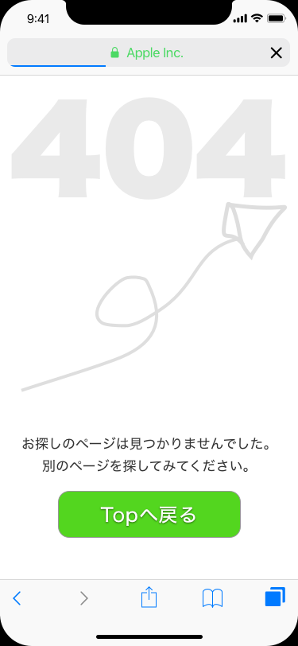

# Artboards

This is an autogenerated file showing all the artboards. Do not edit it directly.

## #003 Landing Page

## #004 Calculator

## #006 User Profile

## #007 Settings

## #011 Flash error

## #011 Flash success

## Album Photo

## Basic Input

## Button

## Chat

## Comment

## Day2 Credit Card Checkout

## Detail Cell

## Dividers 

## E-Commerce Button

## E-Commerce Button

## E-Commerce Shop

## First

## Graphics 

## On

## Panel

## Review_stars

## Safari

## Second A

## Second B

## Star_harf_on

## Star_off

## Star_on

## Twitter_Social_Icon_Rounded_Square_Color

## UI Bars 

## UI Controls 

## btn_google_dark_normal_ios

## calclator_nums

## flogo_RGB_HEX-114

## iPhone X

## separator

## user_icon

